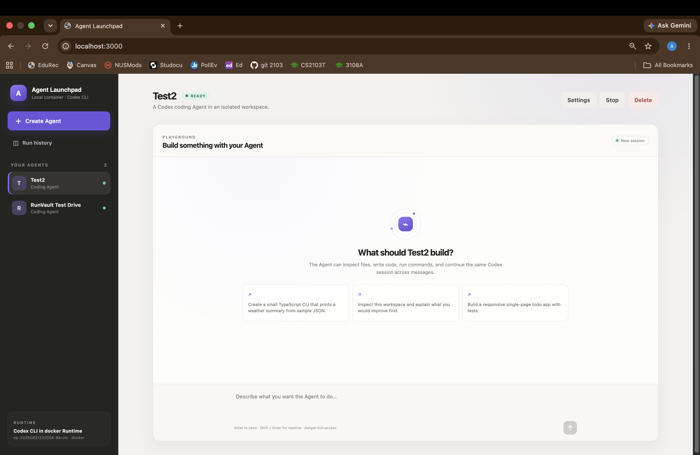
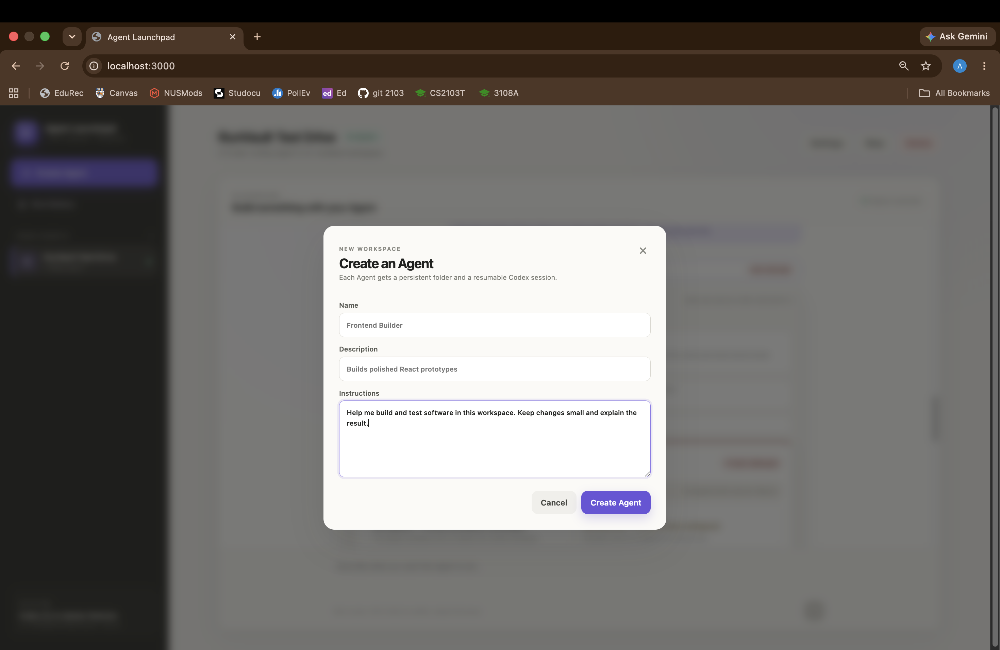
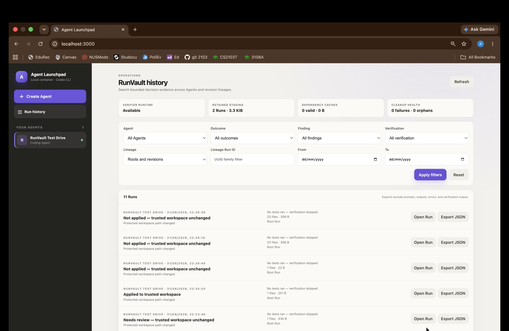
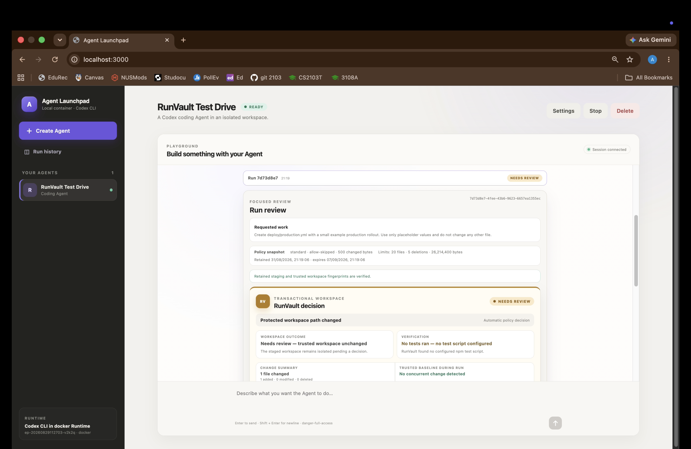
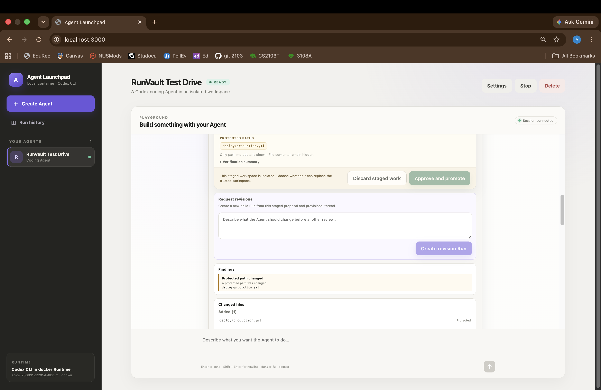
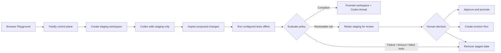

# RunVault

**Transactional workspace middleware for AI coding agents.** RunVault stages
every Agent Run outside the trusted workspace, inspects the proposed changes,
runs available tests in an isolated verifier, and only then decides whether the
workspace and Codex conversation should be promoted, quarantined, or discarded.

RunVault extends the **Volc Agent Launchpad** hackathon baseline. The baseline
provided Agent CRUD, a browser Playground, persistent workspaces, Codex sessions,
local containers, and Volcengine ECS deployment. RunVault adds the transaction,
policy, review, recovery, and evidence layers around every Run.

> **RunVault's guarantee:** an Agent cannot write directly to the trusted
> workspace. Only RunVault's inspected promotion path can change it.

> [!WARNING]
> RunVault is a single-user proof of concept, not identity middleware, malware
> detection, or a hardened multi-tenant sandbox. Use only scoped demo
> credentials and disposable data. See [SECURITY.md](SECURITY.md).

## What we added to the baseline

| Volc Agent Launchpad baseline | RunVault extension |
| --- | --- |
| Agent create, edit, start, stop, and delete | A separate staging workspace for every Run |
| Browser Playground and multi-turn chat | Deterministic promote, quarantine, and discard decisions |
| Persistent Agent workspaces and Codex sessions | Protected-path, dependency, file-type, size, deletion, and verification policy checks |
| Disposable local Runtime containers | Offline, resource-limited verification containers |
| React UI and Fastify control plane | A focused review UI with findings, file classifications, and bounded safe diffs |
| Docker and Volcengine ECS deployment paths | Human approval, discard, revision Runs, lineage, history, redacted evidence, and diagnostics |

The workspace and its Codex thread advance together. A discarded or
quarantined Run does not become the context for later trusted work.

## Product preview



*The browser Playground provides a persistent workspace and resumable Codex
session for each coding Agent.*

## Installation

The recommended local path works on macOS or Linux and automatically uses a
running Docker, Colima, or Podman engine.

### Prerequisites

- Node.js 22 or newer
- npm 10 or newer
- One running container engine: Docker, Colima, or Podman
- A Volcengine Ark API key
- A Volcengine Ark endpoint/model ID that supports the Responses API

Codex CLI is already included in the Runtime image.

Check the local tools:

```bash
node --version
npm --version
docker info            # Docker Desktop, Docker Engine, or Colima
# or
podman info
```

Only one of `docker info` or `podman info` needs to succeed.

### 1. Clone the repository

```bash
git clone https://github.com/anushka2503769/ctrl-alt-codejam-2026.git
cd ctrl-alt-codejam-2026
```

If the repository is already provided, open a terminal in its root directory
and continue with step 2.

### 2. Set the two required Ark values

```bash
export ARK_API_KEY="your-ark-api-key"
export ARK_MODEL="ep-your-endpoint-id"
```

`ARK_MODEL` must be a Responses-compatible endpoint or model ID, commonly an
`ep-...` endpoint ID. The default API base URL is Volcengine Ark's Beijing v3
endpoint and can be changed with `ARK_BASE_URL`.

### 3. Start RunVault

```bash
npm run poc
```

On the first run, this command:

1. installs the locked npm dependencies with `npm ci`;
2. detects Docker, Colima, or Podman;
3. builds the pinned `volc-agent-runtime:local` image;
4. checks that the Runtime can safely mount its managed directories;
5. builds the Web UI and API; and
6. starts RunVault on <http://localhost:3000>.

The first build needs network access for npm, the base image, system packages,
and Codex CLI, so it can take a few minutes. Later starts reuse local caches.

### 4. Open and verify the app

Open <http://localhost:3000>. The recommended local command binds to loopback,
so it does not require the shared access-token screen.

Create an Agent with:

- **Name:** `RunVault Demo`
- **Description:** `Exercises safe and quarantined coding-agent changes`
- **Instructions:** `Make only the requested changes. Keep changes small and explain the result.`

Then run these two prompts one at a time.

Safe change — expected outcome: **Applied to trusted workspace**:

```text
Create docs/welcome.md with a heading and three bullet points describing this
RunVault demo workspace. Do not change any other file.
```

Protected change — expected outcome: **Needs review — trusted workspace
unchanged**:

```text
Create deploy/production.yml with a small placeholder production rollout. Do
not change any other file.
```

Expand the Run card to inspect its findings and verification status. From the
quarantined Run, you can:

- select **Approve and promote** to apply it intentionally;
- select **Discard staged work** to remove the proposal; or
- request a revision that moves the proposal to a safe path such as
  `docs/rollout-plan.md`.

Open **Run history** in the sidebar to filter decisions, revisit the exact Run,
view diagnostics, and download its redacted JSON evidence.

For the complete browser walkthrough, including approval, discard, revisions,
multiple simultaneous findings, and strict policy, see the
[RunVault hands-on test drive](docs/RUNVAULT_TEST_DRIVE.md).

### 5. Stop and resume

Press `Ctrl+C` in the startup terminal. Temporary Runtime containers are
removed, while Agent workspaces, Run history, and Codex sessions remain on disk.

- macOS: `~/.volc-agent-launchpad/`
- Linux: `.local/` inside the repository
- Custom location: set `LOCAL_POC_DATA_ROOT`

Export `ARK_API_KEY` and `ARK_MODEL` again in a new terminal, then rerun
`npm run poc` to resume.

### Common startup problems

| Symptom | What to check |
| --- | --- |
| `No running Docker, Colima, or Podman engine was found` | Start Docker Desktop, run `colima start`, or start the Podman machine, then rerun `npm run poc`. |
| The Runtime cannot mount the state directory | Set `LOCAL_POC_DATA_ROOT` to a directory shared with the container engine. |
| Port 3000 is already in use | Stop the other process or start with `PORT=3001 npm run poc`, then open that port. |
| The UI says the Ark model is not configured | Confirm both variables are exported in the same terminal that runs `npm run poc`. |
| The first image build cannot reach a registry or package mirror | See the restricted-network options in [Local POC](docs/LOCAL_POC.md#common-options). |

When the server is running, this endpoint reports Runtime readiness without
exposing the Ark API key:

```bash
curl --fail http://localhost:3000/api/system
```

## Product tour

### Create an Agent



*Each Agent is configured with its own name, purpose, and workspace instructions
before it begins handling Runs.*

### Run history and operational diagnostics



*After Agents complete work, operators can search decisions across Runs, reopen
the exact review, and export bounded redacted JSON evidence.*

### Review and resolve a quarantined Run



*A protected change is retained in staging while the trusted workspace remains
unchanged. Workspace outcome and verification status are reported separately.*



*The operator can approve and promote the staged proposal, discard it, or
request a child revision Run without trusting the parent proposal.*

## How RunVault decides



| Outcome | Meaning | Trusted workspace |
| --- | --- | --- |
| **Promoted** | The Run satisfied policy or was explicitly approved. | Replaced atomically with the staged workspace. |
| **Quarantined** | The proposal needs review, for example because it touched `deploy/**`, `.env*`, a dependency file, a binary, or a configured limit. | Unchanged; staging is retained temporarily. |
| **Discarded** | Execution failed, timed out, was cancelled, exceeded staging quota, failed verification, or was manually discarded. | Unchanged; staged state is removed. |

Verification is reported separately from the workspace outcome. Under the
default `standard` profile, a safe workspace with no `npm test` script can be
promoted with verification marked as skipped. The `strict` profile requires
verification to pass.

## Features

### Transactional workspace safety

- Per-Run staging; the Agent runner never receives the trusted workspace
- Same-filesystem promotion with a retained backup and restart reconciliation
- Trusted Git metadata excluded from staging and hashing, then preserved across
  promotion and recovery
- Workspace and Codex conversation promoted as one decision
- Provisional Codex threads for quarantined work
- Per-Run and aggregate staging quotas plus configurable quarantine retention

### Policy and verification

- Immutable policy snapshot recorded with every Run
- `standard` and `strict` policy profiles with environment-variable overrides
- Built-in protection for `.env*`, `.git/**`, `.codex/**`, `AGENTS.md`,
  `.github/workflows/**`, `infra/**`, `deploy/**`, and `node_modules/**`
- Detection of dependency files, symbolic links, executable or binary files,
  changed-file counts, deletions, and changed bytes
- All findings reported together while deterministic precedence selects the
  final outcome
- Configured npm tests run without network access in a disposable,
  resource-limited verification container
- Optional content-keyed npm dependency caches prepared explicitly and mounted
  read-only; packages are never installed automatically during Agent Runs

### Review and evidence

- Changed-file classifications and bounded text diffs for reviewable files
- Protected file contents withheld from decision evidence
- Approve, discard, or request revisions without trusting the parent proposal
- Cross-Agent history filters for outcome, finding, verification, lineage, and
  date
- Redacted JSON evidence export that omits prompts, Agent output, Run errors,
  verification output, secrets, and absolute workspace paths
- Bounded lifecycle events and numeric operational metrics
- Diagnostics for verifier availability, retained staging, dependency caches,
  cleanup failures, and orphaned staging

### Platform

- React 19 and TypeScript Web UI
- Fastify control plane with asynchronous Run state
- Persistent Agent workspaces and Codex sessions
- Disposable Docker, Colima, or Podman container for every local Agent turn
- Docker Compose and Terraform deployment paths for Volcengine ECS

## Tech stack

| Layer | Technology |
| --- | --- |
| Frontend | React 19, TypeScript, and Vite 7 |
| Backend | Node.js 22, Fastify 5, and TypeScript |
| Agent Runtime | Codex CLI 0.150.1 |
| Model provider | Volcengine Ark Responses API |
| Runtime isolation | Docker, Colima, or Podman |
| Verification | Offline disposable containers with CPU, memory, process, timeout, and output limits |
| Persistence | JSON metadata, Agent workspaces, and Codex session directories |
| Testing | Vitest 4, TypeScript typechecking, production builds, and a container-backed release gate |
| Deployment | Docker Compose and Terraform for Volcengine ECS |

## Repository structure

```text
.
├── apps/
│   ├── web/src/
│   │   ├── App.tsx                    # Agent Playground and Run lifecycle
│   │   ├── RunVaultPanel.tsx          # Decision summary and actions
│   │   ├── RunVaultReview.tsx         # Findings, classifications, and diffs
│   │   └── RunVaultHistory.tsx        # History filters, evidence, and diagnostics
│   └── server/src/
│       ├── agent-service.ts            # Agent and Run orchestration
│       ├── runvault-workspace.ts       # Staging, promotion, and recovery
│       ├── runvault-policy.ts          # Deterministic decision engine
│       ├── runvault-verifier.ts        # Verification discovery and results
│       ├── runvault-review.ts          # Bounded review evidence
│       ├── runvault-history.ts         # Cross-Agent history and exports
│       └── runvault-observability.ts   # Lifecycle metrics and diagnostics
├── deploy/volcengine/                  # Terraform infrastructure
├── docs/                               # Architecture, test drive, and release evidence
├── scripts/                            # Startup, deployment, and release-gate scripts
├── Dockerfile                          # Application image
├── Dockerfile.runtime                  # Agent and verification Runtime image
├── docker-compose.yml                  # Local containerized deployment
└── .env.example                        # Configuration reference
```

See [Architecture](docs/ARCHITECTURE.md) for component boundaries, trust
boundaries, promotion recovery, storage, and extension points.

## Limitations and security scope

RunVault deliberately provides a narrow transactional-workspace guarantee. It
controls how Agent changes enter the trusted workspace, but it is not a complete
production security platform.

- RunVault is a single-operator proof of concept. Its shared token is not user
  identity, authorization, RBAC, or tenant isolation, and the application does
  not implement CSRF protection.
- Agent and verification Runtimes use ordinary containers, not hardened
  multi-tenant sandboxes. ECS mode does not provide a separate container
  boundary for every Agent.
- Docker Compose gives the control plane access to the host Docker socket.
  Agent and verification containers do not receive that socket, but compromise
  of the control plane could still affect the host.
- The Ark API key is available to the server and active Agent Runtime. Use a
  scoped, revocable demo key and never provide production data or credentials.
- Run history, evidence, metrics, and diagnostics use single-process JSON
  persistence. They are redacted operational evidence, not a signed,
  append-only, or tamper-proof audit log.
- Quarantined staging expires according to the configured retention period.
  After expiry, the staged files cannot be approved or recovered.

See [SECURITY.md](SECURITY.md) for the complete threat model, operational
constraints, and safe-use guidance.

## Configuration

The recommended `npm run poc` path needs only `ARK_API_KEY` and `ARK_MODEL`.
These are the most useful optional settings:

| Variable | Default | Purpose |
| --- | --- | --- |
| `ARK_BASE_URL` | Beijing v3 endpoint | Ark OpenAI-compatible API URL. |
| `APP_AUTH_TOKEN` | Empty on loopback | Shared demo token; required for non-loopback production use. |
| `LOCAL_POC_DATA_ROOT` | Platform-specific | Persistent local data, workspace, and Codex-session root. |
| `CONTAINER_ENGINE` | Auto-detected | Force `docker` or `podman`; Colima uses `docker`. |
| `RUNVAULT_POLICY_PROFILE` | `standard` | Set `strict` for lower limits and required passing verification. |
| `RUNVAULT_PROTECTED_PATTERNS` | `[]` | JSON array of additional relative protected globs. Built-ins cannot be removed. |
| `DEPENDENCY_MODE` | `disabled` | `existing-cache` requires a prepared cache; `isolated-ci` enables explicit preparation. |
| `CODEX_TIMEOUT_MS` | `600000` | Maximum duration of one Agent turn. |
| `VERIFICATION_TIMEOUT_MS` | `120000` | Maximum duration of isolated verification. |

See [.env.example](.env.example) for every Runtime, policy, quota, retention,
dependency, and resource-limit option.

### Force a container engine

```bash
CONTAINER_ENGINE=podman \
ARK_API_KEY="your-ark-api-key" \
ARK_MODEL="ep-your-endpoint-id" \
npm run poc
```

See [Local POC](docs/LOCAL_POC.md) for rootless Podman setup and restricted
network options.

## Docker Compose installation

Use this path to run the Web UI and control plane inside Docker as well as the
Agent and verification Runtimes.

```bash
./scripts/bootstrap-local.sh
```

Edit the generated `.env` and set at least:

```dotenv
ARK_API_KEY=your-ark-api-key
ARK_MODEL=ep-your-endpoint-id
APP_AUTH_TOKEN=replace-with-at-least-24-random-characters
```

Then start the stack:

```bash
CONTAINER_ENGINE_BINARY="$(command -v docker)" docker compose up --build
```

Open <http://localhost:3000> and enter the same `APP_AUTH_TOKEN` in the unlock
screen. Stop the stack without deleting Agent data:

```bash
docker compose down
```

## Development installation

The development path runs Vite and Fastify on the host, so it also requires the
pinned Codex CLI version:

```bash
npm ci
cp .env.example .env
npm install --global @openai/codex@0.150.1
```

Edit `.env`, set the Ark values, and change the Docker-oriented paths to local
paths:

```dotenv
APP_DATA_DIR=.data
AGENT_WORKSPACE_ROOT=workspaces
CODEX_HOME=codex-home
```

Start both development servers:

```bash
npm run dev
```

- Web UI: <http://localhost:5173>
- API: <http://localhost:3000>

Host verification is available only as an explicit development/test fallback;
production configuration rejects it.

## Deployment

- [Existing Linux ECS with Docker](docs/DEPLOYMENT.md#existing-linux-ecs)
- [Complete Volcengine environment with Terraform](docs/DEPLOYMENT.md#terraform-deployment)
- [Local Docker, Colima, and Podman details](docs/LOCAL_POC.md)

Deploy the current source tree to an existing ECS host:

```bash
cp .env.example .env.production
./scripts/deploy-existing-ecs.sh .env.production
```

Or provision the Volcengine network and ECS resources with Terraform:

```bash
cp deploy/volcengine/terraform.tfvars.example \
  deploy/volcengine/terraform.tfvars
./scripts/deploy-volcengine.sh
```

## Validation

Run the ordinary developer gate:

```bash
npm run check
```

Validate the infrastructure definitions when Terraform and Docker Compose are
installed:

```bash
terraform fmt -check -recursive deploy/volcengine
LAUNCHPAD_ENV_FILE=.env.example docker compose config --quiet
```

The complete release gate covers adversarial policy cases, recovery,
performance, real container isolation, and 25 consecutive full-suite passes:

```bash
npm run release-gate
```

It requires Terraform, Docker Compose, a running Docker daemon, and the existing
local Runtime image. It does not install dependencies or pull images. See the
[release-gate evidence matrix](docs/RELEASE_GATE.md) for scope and recorded
results.

## Documentation

- [Architecture](docs/ARCHITECTURE.md)
- [RunVault hands-on test drive](docs/RUNVAULT_TEST_DRIVE.md)
- [Release gate and evidence matrix](docs/RELEASE_GATE.md)
- [Local POC](docs/LOCAL_POC.md)
- [Deployment](docs/DEPLOYMENT.md)
- [Hackathon extension guide](docs/HACKATHON_EXTENSION_GUIDE.md)
- [Security policy](SECURITY.md)
- [Contributing](CONTRIBUTING.md)

## License

[MIT](LICENSE)
