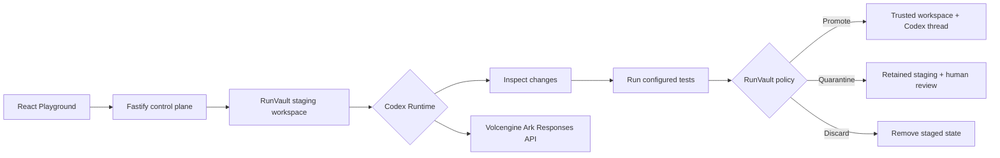

# RunVault

Transactional workspace middleware for AI coding agents, built on the Volc
Agent Launchpad baseline. Every Agent Run is staged and inspected before its
workspace and Codex thread can become trusted state. When a test script is
configured and safe to execute, its result is reported separately.

Run it locally with Docker, Colima, or rootless Podman, or deploy it to
Volcengine ECS.

> [!WARNING]
> This is a single-user proof of concept. RunVault provides a narrow
> transactional-workspace guarantee; it is not identity middleware, malware
> detection, or a hardened security sandbox. Do not use production data or
> credentials. See [SECURITY.md](SECURITY.md).

## Screenshots

### Agent Playground


### Create an Agent


## Features

- Transactional staging for every Agent Run
- Trusted Git metadata excluded from staging and hashing, then preserved across
  promotion and recovery
- Deterministic promote, quarantine, and discard policy
- Explicit verification status, with configured tests run in a no-network,
  resource-limited verification container
- Focused Run review with findings, file classifications, and safe bounded diffs
- Revision Runs that continue quarantined proposals without approving the parent
- Redacted Run evidence with protected-path metadata
- Human approval or discard for quarantined work
- Crash-safe promotion and restart reconciliation
- Workspace and Codex conversation promoted as one decision
- React and TypeScript Web UI
- Agent create, edit, start, stop, delete, and multi-turn chat
- Fastify control plane with asynchronous Run state
- Persistent Agent workspaces and Codex sessions
- Disposable Docker, Colima, or Podman container for each local turn
- Docker and Terraform deployment paths for Volcengine ECS

## Requirements

- Node.js 22+
- npm 10+
- Docker, Colima, or Podman
- A Volcengine Ark API key and endpoint that supports the Responses API

Codex CLI is included in the Runtime image and is not required on the host.

## Local browser SOP

### 1. Check the local tools

Install Node.js 22+ and one supported container engine, then verify them:

```bash
node --version
npm --version
docker --version        # Docker Desktop, Docker Engine, or Colima
podman --version        # Use this instead when running Podman
```

Only one container engine is required. Codex CLI is already included in the
Runtime image.

### 2. Clone the repository

```bash
git clone <repository-url> volc-agent-launchpad
cd volc-agent-launchpad
```

Skip this step when already working from the repository root.

### 3. Start the POC

```bash
ARK_API_KEY=your-ark-api-key \
ARK_MODEL=ep-your-endpoint-id \
npm run poc
```

The first run installs Node.js dependencies and builds the Runtime image. The
script automatically selects Docker, Colima, or Podman.

### 4. Open the browser

Visit <http://localhost:3000>, or open it from the terminal:

```bash
open http://localhost:3000       # macOS
xdg-open http://localhost:3000   # Linux desktop
```

In the Web UI:

1. Select **Create Agent**.
2. Enter a name, description, and workspace instructions.
3. Select **Create Agent** again.
4. Enter a task in the Playground, for example:

   ```text
   Create a TypeScript hello-world CLI, add a test, and run it.
   ```

The Agent can write files and run commands. Later messages fork from the last
promoted Codex session, keeping discarded or quarantined context provisional.

After each completed Run, inspect the **RunVault decision** panel. Workspace
outcome and verification status are shown separately. Policy-compliant work is
promoted automatically; risky changes remain isolated and offer **Approve and
promote** and **Discard staged work** controls.

To exercise quarantine deliberately, try:

```text
Update deploy/production.yml with a new production rollout configuration.
```

RunVault shows the protected path and verification metadata, but never displays
the protected file's contents in its decision evidence.

### 5. Stop and resume

Press `Ctrl+C` in the startup terminal. The script removes temporary Runtime
containers but keeps Agent workspaces and conversations.

- macOS state: `~/.volc-agent-launchpad/`
- Linux state: `.local/`
- Custom location: set `LOCAL_POC_DATA_ROOT`

Run the same `npm run poc` command to continue later.

### Select a specific container engine

Force Podman when multiple engines are installed:

```bash
CONTAINER_ENGINE=podman \
ARK_API_KEY=your-ark-api-key \
ARK_MODEL=ep-your-endpoint-id \
npm run poc
```

Colima uses `CONTAINER_ENGINE=docker` because it exposes the Docker CLI.

For a clean Linux host, follow the
[rootless Podman setup](docs/LOCAL_POC.md#rootless-podman-on-linux).

## Docker Compose

Create and edit the configuration:

```bash
./scripts/bootstrap-local.sh
```

Required values in `.env`:

```dotenv
ARK_API_KEY=your-ark-api-key
ARK_MODEL=ep-your-endpoint-id
APP_AUTH_TOKEN=replace-with-at-least-24-random-characters
```

Start the application:

```bash
CONTAINER_ENGINE_BINARY="$(command -v docker)" docker compose up --build
```

Compose builds the pinned local verification Runtime before starting the app
and gives only the control plane access to the host engine. Run containers use
`--pull never`, so starting a Run never downloads an image.

Open <http://localhost:3000>. Stop it without deleting Agent data:

```bash
docker compose down
```

## Development

```bash
npm install
cp .env.example .env
npm install --global @openai/codex@0.150.1
npm run dev
```

- Web UI: <http://localhost:5173>
- API: <http://localhost:3000>

Use local paths in `.env` when running outside Docker:

```dotenv
APP_DATA_DIR=.data
AGENT_WORKSPACE_ROOT=workspaces
CODEX_HOME=codex-home
```

## Deployment

- [Existing Linux ECS with Docker](docs/DEPLOYMENT.md#existing-linux-ecs)
- [Complete Volcengine environment with Terraform](docs/DEPLOYMENT.md#terraform-deployment)
- [Local Docker, Colima, and Podman details](docs/LOCAL_POC.md)

The existing-ECS script deploys from the current source tree:

```bash
cp .env.example .env.production
./scripts/deploy-existing-ecs.sh .env.production
```

The Terraform path provisions VPC, subnet, security group, ECS, and EIP:

```bash
cp deploy/volcengine/terraform.tfvars.example \
  deploy/volcengine/terraform.tfvars
./scripts/deploy-volcengine.sh
```

## Configuration

| Variable | Default | Purpose |
| --- | --- | --- |
| `ARK_API_KEY` | Required | Ark model API key. |
| `ARK_MODEL` | Required | Responses-capable endpoint or model ID. |
| `ARK_BASE_URL` | Beijing v3 endpoint | Ark OpenAI-compatible API URL. |
| `APP_AUTH_TOKEN` | Empty on loopback | Shared demo token; use 24+ random characters remotely. |
| `RUNTIME_PROVIDER` | `local-process` | `container` for disposable local Runtime containers. |
| `VERIFICATION_PROVIDER` | `container` | `host` is an explicit development/test-only fallback and is rejected in production. |
| `VERIFICATION_WORKSPACE_HOST_ROOT` | Workspace root | Host-side workspace path when the server runs inside a container. |
| `CONTAINER_RUNTIME_IMAGE` | `volc-agent-runtime:local` | Prebuilt image used for Agent and verification containers. |
| `CODEX_SANDBOX_MODE` | `workspace-write` | Codex inner sandbox mode. |
| `CODEX_TIMEOUT_MS` | `600000` | Maximum duration of one turn. |
| `LOCAL_POC_DATA_ROOT` | Platform-specific | Local metadata, workspace, and session directory. |

See [.env.example](.env.example) for all Runtime and resource-limit options.

## How it works



The trusted workspace is never passed to the Agent runner. The first turn uses
`codex exec` in staging; later turns use `codex exec fork` from the last
promoted thread. Promotion uses a same-filesystem swap with a retained backup,
and startup reconciliation repairs interrupted transactions.

RunVault's deliberate guarantee is:

> An Agent cannot write directly to the trusted workspace; only RunVault's
> inspected promotion path can change it.

Deleting an Agent archives its workspace under `workspaces/.deleted/`.

See [docs/ARCHITECTURE.md](docs/ARCHITECTURE.md) for component and extension
boundaries.

## Validation

```bash
npm run check
terraform fmt -check -recursive deploy/volcengine
docker compose config
```

The automated workspace safety corpus covers safe source and documentation
changes, protected and secret-like paths, dependency files, change limits,
verification failures, runner failures, cancellation, timeout, approval,
discard, provisional Codex threads, and crash recovery. Risky and interrupted
scenarios assert that the trusted workspace content or fingerprint is unchanged.

## Documentation

- [Architecture](docs/ARCHITECTURE.md)
- [Local POC](docs/LOCAL_POC.md)
- [Deployment](docs/DEPLOYMENT.md)
- [Hackathon extension guide](docs/HACKATHON_EXTENSION_GUIDE.md)
- [Security policy](SECURITY.md)
- [Contributing](CONTRIBUTING.md)

## License

[MIT](LICENSE)
