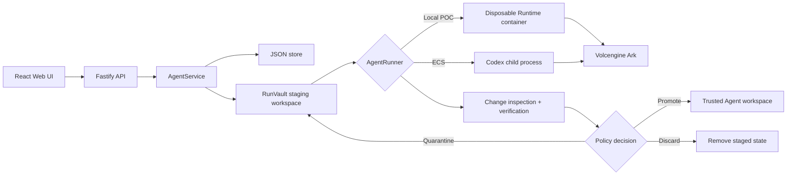

# Architecture

RunVault extends the Volc Agent Launchpad single-node control plane with a
transactional workspace boundary for hackathon use.



## Components

### Web UI

Lists Agents, manages lifecycle actions, submits prompts, and polls asynchronous
Runs. It never receives the Ark API key.

### Fastify API

Validates requests, protects remote demos with a shared bearer token, and
serves the compiled Web UI. The token is not user identity or authorization.

### AgentService

Coordinates lifecycle state, persistence, RunVault transactions, and Runs. One
Agent can have only one active Run or quarantine-resolution operation.

```text
ready -> busy -> ready
  |       |
  v       v
stopped  error
```

Interrupted Runs become `cancelled` after a restart, their staging workspaces
are discarded, and the trusted workspace remains unchanged.

### RunVault workspace boundary

Every Run receives `workspaces/.staging/<run-id>` instead of the trusted Agent
workspace. RunVault fingerprints the trusted baseline, copies it with explicit
filesystem handling, executes Codex in staging, inspects the resulting change
set, runs configured verification, and applies deterministic policy.

```text
trusted workspace -> staging -> inspect -> verify -> decide
                                      |          |-> promote
                                      |          |-> quarantine
                                      |          |-> discard
                                      +-- trusted workspace remains isolated
```

Promotion renames the trusted workspace to a temporary backup and atomically
installs staging on the same filesystem. A durable promotion marker and the
persisted Run decision let startup reconciliation either finish the promotion
or restore the backup after an interruption.

RunVault treats `node_modules` as platform-managed metadata. It never traverses,
content-hashes, copies into staging, or promotes those trees as Agent source.
Existing trusted root and nested trees are inventoried by path and preserved
across promotion or crash recovery for compatibility, but they are never
mounted into Agent or verification containers. Agent-created `node_modules`,
including an empty directory, is a protected dependency change and cannot be
promoted.

Optional managed npm caches are immutable and keyed by Runtime image ID, actual
container platform, npm version, and `package.json`/`package-lock.json`
digests. A matching cache's `node_modules` is mounted read-only into both the
Agent and no-network verifier. A dependency-file change cannot use the prior
cache. Runs fail before Agent execution when a required initial cache is
missing; after a dependency change, verification is skipped and policy retains
the staging workspace for review. Only the explicit authenticated preparation
endpoint may run networked `npm ci`, and it disables lifecycle scripts.

Trusted `.git` files and directories, including nested repository metadata, are
inventoried by path but never copied into staging or content-hashed. A staging
snapshot records Agent-created `.git` as one bounded protected entry even when
the directory is empty; it cannot be approved. Version-two promotion markers
move trusted Git metadata from the backup into the installed workspace and let
restart recovery complete or reverse a partially transferred set. Version-one
and version-two markers remain readable for interrupted promotions created by
older releases; version-three markers also inventory preserved dependency
metadata.
Staging also records path-free duration, copied-entry, and estimated-byte
measurements for later operational reporting.

Policy is selected and validated by the server at startup. Built-in protected
patterns cannot be removed; configured patterns add to them. A deep-cloned
snapshot is attached to each Run and contains file/deletion/changed-byte
limits, verification mode, per-Run and total staging quotas, quarantine
retention, and the effective Agent and verifier Runtime limits. This keeps
historical decisions explainable even after server configuration changes.

Staging creation is serialized for quota accounting. RunVault checks source
size before copying, applies a per-Run copy budget, checks per-Run and aggregate
usage periodically while Codex runs, and checks again before policy and
promotion. A quota breach cancels execution, discards staging, and leaves the
trusted workspace and committed thread unchanged.

Quarantined decisions record retention and expiry timestamps. A serialized,
idempotent sweep marks due Runs discarded with an `expired` resolution before
removing their staging. Approval and revision reserve the Agent as busy, so an
expiry sweep cannot race a decision transaction or advance a provisional
thread. Redacted findings, manifests, verification evidence, fingerprints, and
the policy snapshot remain in the JSON record after staging cleanup.

New symbolic links are quarantined before verification. Verification invokes
only the configured `npm test` command in a disposable no-network Runtime
container with a scrubbed environment, dropped capabilities, resource limits,
bounded output, and a timeout. Test output stored in Run evidence is redacted.
Only a validated `.staging/<run-id>` source may be bind-mounted. In Docker
Compose, the control plane translates its container workspace path to the
host-side workspace root; the verification container never receives the
trusted workspace, Codex home, credentials, or Docker socket.

### Storage

```text
data/launchpad.json       Agent, message, and Run metadata
workspaces/AgentID/       Trusted, promoted Agent files
workspaces/.staging/      Provisional Runs, backups, and promotion markers
workspaces/.deleted/      Archived deleted workspaces
codex-home/               Codex configuration and sessions
```

`JsonStore` serializes writes and atomically replaces one JSON file. It supports
one process only.

### History and operational diagnostics

Every Run stores a bounded sequence of typed lifecycle events: staged,
inspected, verified, decided, revision requested, approved, promoted,
discarded, expired, and reconciled. The oldest event is dropped after the
per-Run limit of 100. Events accept only predefined enum values, timestamps,
and related Run IDs; they do not accept arbitrary messages or file content.

Persisted Run metrics use a fixed path-free schema for staging, Agent,
inspection, verification, decision, and cleanup duration; staged entries and
bytes; changed files and bytes; outcome; verification status; and cleanup
status. A Node diagnostics channel publishes the same bounded metadata shape
for optional process-local consumers.

The authenticated global history endpoint derives redacted summaries from the
JSON store and supports Agent, outcome, finding, verification, root/revision,
lineage-family, date, and bounded-limit filters. Evidence export deliberately
omits prompt, Agent output, Run error, verification output, and absolute paths.
It preserves relative changed paths and policy metadata so a decision remains
explainable.

Authenticated diagnostics combine persisted Run metrics with current retained
staging size, missing staging, orphan/transaction cleanup state, dependency
cache validity and size, and verifier Runtime availability. `/api/health`
remains a minimal public liveness response. Diagnostics are operational
observability, not an authorization or integrity boundary.

### Runtime providers

- `CodexRunner` runs Codex inside the application container for ECS.
- `ContainerCodexRunner` starts one disposable Docker, Colima, or Podman
  container for every local turn.

Both providers use argv-only process execution, bound output and time, fork
from the last promoted Codex thread, and escalate termination after a grace
period. A fork remains provisional while its workspace is staged and becomes
the Agent's committed thread only when RunVault promotes that workspace.

## Deployment profiles

| Profile | Control plane | Agent execution |
| --- | --- | --- |
| Local POC | Host Node.js | Disposable local container |
| ECS | Application container | Codex process in the same container |
| Local development | Host Node.js | Host Codex process |

## Extension seams

| Track | Primary seam | Expected change |
| --- | --- | --- |
| Glass Box | `AgentRunner`, `AgentRun` | Emit and display correlated execution events. |
| Bouncer | API routes, Agent ownership | Add identity and server-side authorization. |
| Kill Switch | `AgentRunner` | Add threat-specific policy or a stronger sandbox. |

The current container or ECS instance is the POC trust boundary. Ordinary
containers are not hardened multi-tenant isolation.

The history store is explicitly single-process JSON. It has no append-only
integrity chain, external witness, signature, or user attribution and therefore
must not be described as tamper-proof or as a multi-user audit log.
